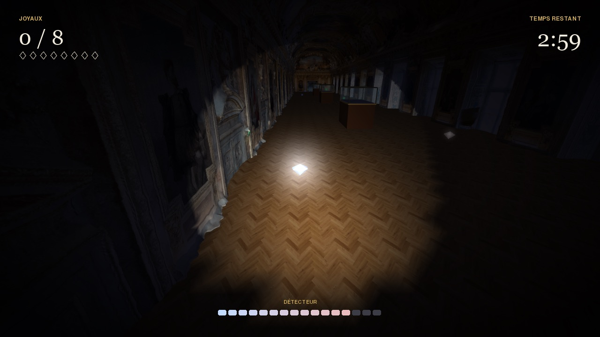

# VirtuLouvre

VirtuLouvre est un jeu vidéo 3D qui se déroule dans la **galerie d'Apollon** du musée du Louvre, reconstituée à partir d'un scan 3D. Il est écrit en Python avec pygame-ce, OpenGL et NumPy, et fonctionne sous **Windows, macOS et Linux**.


## Deux façons de jouer

- **Mission : les joyaux de la Couronne.** Le 19 octobre 2025, huit joyaux de la Couronne ont été volés dans la galerie d'Apollon. Dans le jeu, les voleurs ont semé leur butin dans la galerie plongée dans le noir. Tu as 3 minutes pour retrouver les 8 joyaux, avec une lampe torche qui fait scintiller les pierres et un détecteur qui bipe de plus en plus vite quand tu t'approches. Les cachettes changent à chaque partie et ton meilleur temps est enregistré.
- **Visite libre.** La galerie est éclairée : promène-toi, ou vole jusqu'au plafond peint par Delacroix.



## Lancer le jeu

Il faut **Python 3.9 ou plus récent** ([python.org](https://www.python.org/downloads/)). Le premier lancement installe les dépendances dans un dossier `.venv`, ce qui prend une minute ; les suivants démarrent tout de suite.

| Système | Comment lancer |
| --- | --- |
| Windows | Double-clic sur `lancer.bat` (pendant l'installation de Python, coche « Add python.exe to PATH ») |
| macOS | Double-clic sur `lancer.command`. La première fois, si macOS le bloque : clic droit, puis « Ouvrir » |
| Linux | `./lancer.command` dans un terminal (sur Debian/Ubuntu, il faut le paquet `python3-venv`) |

### Installation manuelle

```bash
python3 -m venv .venv                         # Windows : py -m venv .venv
.venv/bin/python -m pip install -r requirements.txt   # Windows : .venv\Scripts\python ...
.venv/bin/python main.py
```

Pour vérifier l'installation sans ouvrir de fenêtre : `python main.py --test`.

### En cas de problème

- **`pygame` et `pygame-ce` en même temps** : les deux s'installent dans le même dossier `pygame` et se marchent dessus. Fais `pip uninstall pygame pygame-ce`, puis `pip install -r requirements.txt`.
- **Carte graphique** : il faut OpenGL 2.0 (toutes les cartes depuis 2004). Sans pilote graphique (machine virtuelle sans 3D, « Carte graphique de base Microsoft »), le jeu affiche un message au lieu de démarrer. Sous Linux, il faut les pilotes Mesa (`sudo apt install libgl1` sur Debian/Ubuntu).
- **Pas de son** : le jeu continue en silence si l'ordinateur n'a pas de sortie audio.
- **Vieille carte graphique** : les textures sont réduites automatiquement si elles dépassent la taille maximale supportée.

## Commandes

| Touche | Action |
| --- | --- |
| Z Q S D, W A S D ou flèches | Se déplacer (AZERTY et QWERTY marchent tous les deux) |
| Souris | Regarder |
| Maj | Courir |
| Espace | Sauter / monter (en vol) |
| G | Voler / atterrir (visite libre) |
| C | Descendre (en vol) |
| Échap | Pause / retour |
| F11 ou Alt+Entrée | Plein écran (sur Mac, F11 règle le volume : utilise Option+Entrée) |
| F12 | Capture d'écran (dossier `captures/`) |

Toutes les touches (sauf Échap, F11, F12 et les flèches) se changent dans **Paramètres > Touches**. Les réglages (touches, volume, champ de vision, sensibilité, résolution, record) sont enregistrés dans `config/settings.json`.

## Structure du projet

```
VirtuLouvre/
├── main.py              # Le jeu (un seul fichier)
├── requirements.txt     # Dépendances : pygame-ce, NumPy, PyOpenGL
├── lancer.bat           # Lanceur Windows
├── lancer.command       # Lanceur macOS / Linux
├── config/              # Réglages du joueur
├── src/
│   ├── models/          # Scan 3D de la galerie (.obj)
│   ├── textures/        # Texture du scan, parquet, ciel
│   ├── media/           # Bruits de pas
│   └── icons/           # Icônes de l'interface
├── docs/                # Aperçus pour ce README
├── dependances/         # Anciens installeurs (Windows .exe, script shell)
└── Tests/               # Prototypes de l'équipe
```

## Documentation technique

Tout le jeu est dans `main.py` :

- **`load_model`** lit le fichier `.obj` (sommets, UV, normales) et le transforme en tableaux NumPy envoyés en une fois à la carte graphique (VBO).
- **`Gallery`** regroupe le modèle 3D, les vitrines et la **carte des collisions** : une grille vue de dessus où une case est bloquée si le scan contient de la matière à hauteur du corps. Un parcours en largeur depuis le point de départ ferme les trous du scan par lesquels on pourrait sortir de la galerie. La même carte sert à choisir des cachettes accessibles pour les joyaux.
- **`Player`** gère la caméra à la première personne : déplacements indépendants du nombre d'images par seconde, glissement le long des murs, saut, vol.
- **`Audio`** fabrique les sons (bips, carillons, fanfare) avec NumPy. Il n'y a donc pas de fichiers audio à fournir en plus des bruits de pas.
- **`UI`** dessine l'interface avec pygame sur une surface transparente, envoyée comme texture par-dessus la 3D. Les coordonnées sont virtuelles (720 pixels de haut) pour que l'interface s'adapte à toutes les résolutions.
- **`App`** contient la boucle principale et les écrans (menu, paramètres, crédits, mission, pause, fin). En mission, la galerie est éclairée par une lampe torche (lumière « spot » OpenGL attachée à la caméra).

Le jeu utilise l'OpenGL « classique » (pipeline fixe), disponible partout, y compris sur le contexte OpenGL 2.1 de macOS et les pilotes Mesa de Linux.

## Crédits

Développé par **Albert Oscar**, **Moors Michel** et **Rinckenbach Yann** dans le cadre des Trophées NSI. Texture du ciel : Freepik.

## Licence

Ce projet est sous licence GPL v3+. Voir le fichier `licence.txt`.
