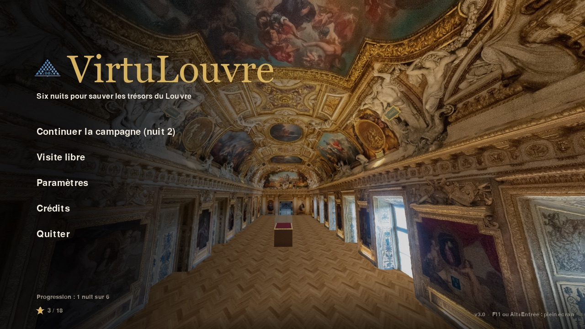
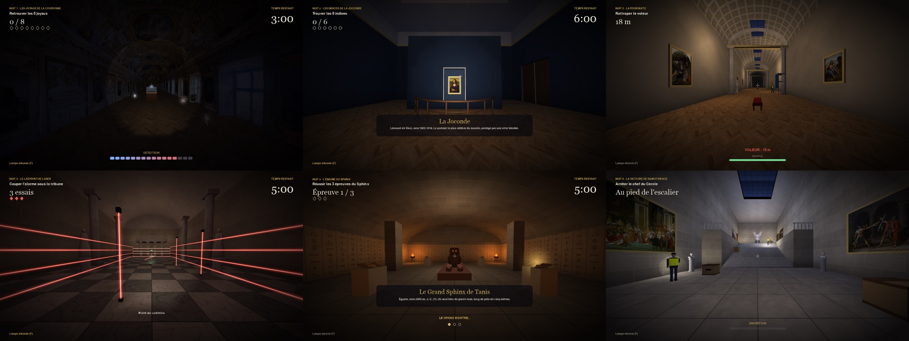
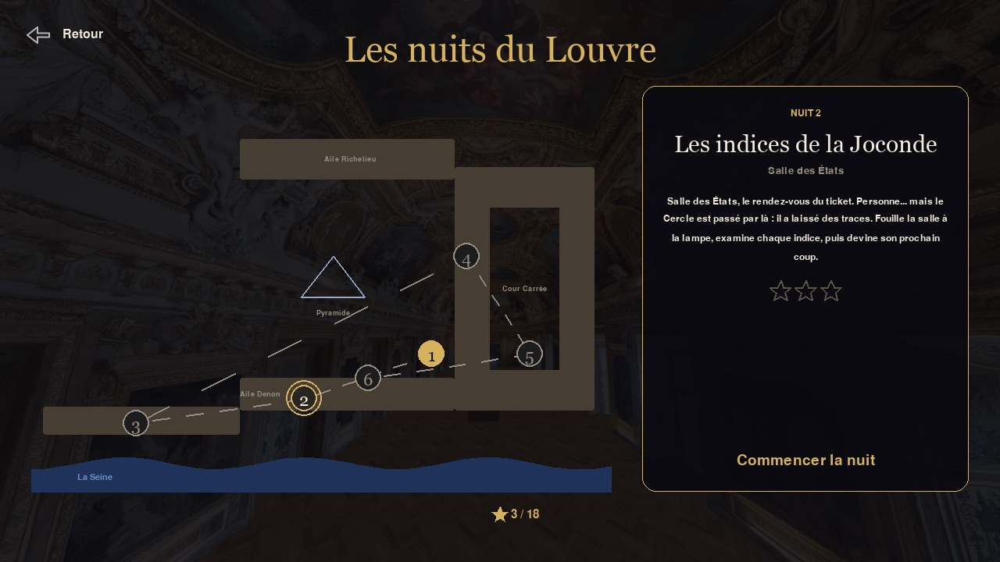

# VirtuLouvre

**Six nuits pour sauver les trésors du Louvre.** VirtuLouvre est un jeu vidéo 3D écrit en Python (pygame-ce, OpenGL, NumPy) qui fonctionne sous **Windows, macOS et Linux**. On y joue une campagne de six missions dans six salles du musée : la galerie d'Apollon, reconstituée à partir d'un scan 3D, et cinq salles modélisées entièrement en code. Les tableaux accrochés aux murs sont les vrais, des reproductions du domaine public.



## La campagne : les nuits du Louvre

Le 19 octobre 2025, huit joyaux de la Couronne ont été volés dans la galerie d'Apollon. Le jeu part de cet événement pour inventer une histoire : une bande de voleurs, le Cercle, frappe le musée nuit après nuit. Chaque nuit se joue dans une salle différente, avec sa propre mécanique.

| Nuit | Salle | Mission | Ce qu'on fait |
| --- | --- | --- | --- |
| 1 | Galerie d'Apollon | Les joyaux de la Couronne | Fouiller la galerie dans le noir, à la lampe torche et au détecteur, pour retrouver les 8 joyaux |
| 2 | Salle des États | Les indices de la Joconde | Examiner 6 indices autour de la Joconde, puis déduire le prochain coup du Cercle |
| 3 | Grande Galerie | La poursuite | Rattraper un faux restaurateur qui s'enfuit avec *La Belle Ferronnière*, en gérant son souffle |
| 4 | Salle des Cariatides | Le labyrinthe laser | Traverser des rayons fixes, balayants, tournants et clignotants (sauter, s'accroupir) |
| 5 | Crypte du Sphinx | L'énigme du Sphinx | Répéter les séquences de hiéroglyphes du Sphinx pour ouvrir sa cachette |
| 6 | Escalier Daru | La Victoire de Samothrace | S'infiltrer entre les guetteurs et leurs lampes, puis arrêter le chef du Cercle |



Chaque nuit réussie débloque la suivante sur la carte du musée, et rapporte de 1 à 3 étoiles selon le temps mis, les erreurs ou la discrétion. La progression et les records sont enregistrés.



## Visite libre

Les six salles se visitent aussi librement, lumières allumées et pleines de monde : des visiteurs vont d'une œuvre à l'autre (certains prennent des photos, d'autres regardent leur téléphone), une foule se presse devant la Joconde, une guide montre les tableaux à son groupe, et un gardien surveille depuis sa chaise. On peut voler jusqu'aux plafonds et s'approcher des œuvres : quand on regarde un tableau ou une statue, son cartel s'affiche (titre, artiste, date).

## Personnages et sons

Tous les personnages sont modélisés et animés en code : gardiens, policiers, voleurs, guetteurs cagoulés, chef du Cercle, conservatrice, guide, et des visiteurs tirés au hasard (visage, peau, coiffure, barbe, lunettes, casquette, béret, sac à dos, audioguide, jupe, manches courtes...). Leur squelette a des genoux, des coudes et une tête qui tourne : ils marchent, courent, lèvent les mains, croisent les bras, s'assoient, pointent un tableau et vous suivent du regard quand vous passez.

Aucun fichier audio : tout est synthétisé au lancement, en arrière-plan. Il y a une musique par nuit (piano pour le menu, pizzicati pour l'enquête, batterie pour la poursuite, arpèges électroniques pour les lasers, harpe orientale pour le Sphinx, pouls sourd pour l'infiltration), des ambiances (pluie sur la verrière, vent et braseros de la crypte, murmure de la foule), des pas qui changent selon le sol (parquet, marbre, pierre), et des bruitages : sonar du détecteur, tintement des joyaux, sifflet, sonnerie d'alarme, menottes, talkie-walkie des guetteurs, battements de cœur quand on est presque repéré, voix du Sphinx...

## Lancer le jeu

Il faut **Python 3.9 ou plus récent** ([python.org](https://www.python.org/downloads/)). Le premier lancement installe les dépendances dans un dossier `.venv`, ce qui prend une minute ; les suivants démarrent tout de suite.

| Système | Comment lancer |
| --- | --- |
| Windows | Double-clic sur `lancer.bat` (pendant l'installation de Python, coche « Add python.exe to PATH ») |
| macOS | Double-clic sur `lancer.command`. La première fois, si macOS le bloque : clic droit, puis « Ouvrir » |
| Linux | `./lancer.command` dans un terminal (sur Debian/Ubuntu, il faut le paquet `python3-venv`) |

### Installation manuelle

```bash
python3 -m venv .venv                                 # Windows : py -m venv .venv
.venv/bin/python -m pip install -r requirements.txt   # Windows : .venv\Scripts\python ...
.venv/bin/python main.py
```

### En cas de problème

- **`pygame` et `pygame-ce` en même temps** : les deux s'installent dans le même dossier `pygame` et se marchent dessus. Fais `pip uninstall pygame pygame-ce`, puis `pip install -r requirements.txt`. Le jeu te le signale au démarrage.
- **Carte graphique** : il faut OpenGL 2.0 (toutes les cartes depuis 2004). Sans pilote graphique (machine virtuelle sans 3D, « Carte graphique de base Microsoft »), le jeu affiche un message au lieu de démarrer. Sous Linux, il faut les pilotes Mesa (`sudo apt install libgl1` sur Debian/Ubuntu).
- **Pas de son** : le jeu continue en silence si l'ordinateur n'a pas de sortie audio.

## Commandes

| Touche | Action |
| --- | --- |
| Z Q S D, W A S D ou flèches | Se déplacer (AZERTY et QWERTY marchent tous les deux) |
| Souris | Regarder |
| Maj | Courir (attention au souffle pendant la poursuite) |
| Espace | Sauter / monter en vol |
| C | S'accroupir (plus discret, passe sous les lasers) / descendre en vol |
| E | Examiner, agir (indices, symboles, alarme, arrestation...) |
| F | Allumer / éteindre la lampe torche |
| G | Voler / atterrir (visite libre) |
| Échap | Pause / retour |
| F11 ou Alt+Entrée | Plein écran (sur Mac, F11 règle le volume : utilise Option+Entrée) |
| F12 | Capture d'écran (dossier `captures/`) |

Toutes les touches (sauf Échap, F11, F12 et les flèches) se changent dans **Paramètres > Touches**. Les réglages et la progression sont enregistrés dans `config/settings.json`. Pour recommencer la campagne depuis le début : **Paramètres > Partie > Réinitialiser la progression**.

## Structure du projet

```
VirtuLouvre/
├── main.py              # Point d'entrée (et auto-test : python main.py --test)
├── jeu/                 # Le jeu
│   ├── app.py           # Boucle principale, rendu, écrans (menu, carte, briefing, pause, fin...)
│   ├── missions.py      # Les six nuits de la campagne
│   ├── salles.py        # Les six salles : géométrie, collisions, lumières, œuvres
│   ├── modeles.py       # Modèles 3D construits en code : personnages, statues, joyaux, mobilier
│   ├── acteurs.py       # Le joueur, les personnages (patrouilles, vision, squelette, poses) et la foule
│   ├── rendu.py         # OpenGL : textures procédurales, maillages, éclairage, effets
│   ├── interface.py     # Interface 2D (boutons, textes, curseurs)
│   ├── sons.py          # Sons, musiques et ambiances synthétisés avec NumPy
│   └── base.py          # Constantes, réglages, petits outils de calcul
├── src/
│   ├── models/          # Scan 3D de la galerie d'Apollon (.obj)
│   ├── tableaux/        # Reproductions d'œuvres du domaine public (voir CREDITS.txt)
│   ├── textures/        # Texture du scan, parquet, ciel
│   ├── media/           # Vidéo des premiers prototypes
│   └── icons/           # Icônes de l'interface
├── config/              # Réglages et progression du joueur
├── docs/                # Aperçus pour ce README
├── lancer.bat           # Lanceur Windows
├── lancer.command       # Lanceur macOS / Linux
├── dependances/         # Anciens installeurs (Windows .exe, script shell)
└── Tests/               # Prototypes de l'équipe
```

## Documentation technique

- **Salles (`salles.py`)** : un constructeur assemble sols, murs à portes, voûtes en berceau, colonnes cannelées, escaliers et tableaux encadrés. Chaque surface est découpée en petits carreaux, parce que l'éclairage OpenGL « classique » est calculé aux sommets et qu'une grande face resterait uniforme. En même temps, il remplit trois cartes vues de dessus : les cases infranchissables, la hauteur du sol (pour les escaliers) et la hauteur des obstacles qui cachent la vue (pour savoir si un guetteur voit le joueur derrière une caisse). La galerie d'Apollon vient d'un scan 3D ; sa carte des collisions est calculée à partir de la matière du scan à hauteur du corps.
- **Modèles (`modeles.py`)** : tout est construit à partir de formes simples (boîtes, surfaces de révolution, tores, tubes le long d'une courbe, pierres taillées, prismes). Les personnages ont dix parties (buste, tête, cuisses, jambes, bras, avant-bras) et une tenue tirée d'une graine : un même visiteur a toujours la même allure. Les couleurs de peau et de vêtements sont des matériaux « rgb:r,g,b » créés à la volée.
- **Textures (`rendu.py`)** : marbre, pierre de taille, dallages, caissons, hiéroglyphes... sont calculés au lancement avec NumPy. Ils utilisent un bruit périodique (une somme de sinusoïdes de fréquences entières), pour que la texture se répète sans raccord visible.
- **Personnages (`acteurs.py`)** : un squelette simple (bassin, hanches, genoux, épaules, coudes, cou) dont les angles viennent de la marche, de la course et des poses. La même chaîne de transformations sert à dessiner (OpenGL) et à calculer où pointe la lampe d'un guetteur (NumPy). Patrouilles avec pauses, champ de vision (portée, angle, obstacles), réaction aux bruits de course. Les visiteurs choisissent une œuvre proche qu'ils peuvent rejoindre en ligne droite, la regardent un moment, puis repartent ; on ne peut pas les traverser.
- **Missions (`missions.py`)** : chaque mission prépare la salle, fait avancer sa logique à chaque image, propose des interactions (touche E) et dessine son morceau d'interface. Les lasers utilisent la distance entre deux segments (le rayon et le corps du joueur).
- **Sons (`sons.py`)** : une petite boîte à outils de synthèse. Synthèse additive (cloches, verre, marimba, piano avec ses partiels légèrement désaccordés, cuivres dont les aigus montent avec le souffle), cordes pincées de Karplus-Strong (harpe, pizzicati), voix par formants (murmure de la foule, talkie-walkie, Sphinx), bruit filtré dans le domaine de Fourier (pas, pluie, pierre qui racle), réverbération par convolution avec une réponse de salle stéréo. Les musiques et ambiances bouclent sans clic : les notes qui dépassent de la fin reviennent au début, et l'écho est une convolution circulaire. Tout est calculé dans un fil d'exécution séparé pendant qu'on regarde le menu.

L'auto-test (`python main.py --test`, sans fenêtre) vérifie les réglages, les modèles et les salles. Il vérifie aussi que chaque joyau est accessible, que l'escalier se monte, qu'un robot qui gère son souffle arrive à rattraper le voleur de la nuit 3, que les visiteurs ne traversent pas les murs, que la lampe des guetteurs éclaire devant eux, et que chaque son se fabrique sans erreur.

## Crédits

Développé par **Albert Oscar**, **Moors Michel** et **Rinckenbach Yann** dans le cadre des Trophées NSI.

- Galerie d'Apollon : scan 3D de la galerie.
- Salles, personnages, statues et joyaux : modélisés en code. Ce sont des évocations libres des vraies salles, et les joyaux des interprétations des originaux.
- Tableaux : reproductions du domaine public, via Wikimedia Commons (liste complète dans `src/tableaux/CREDITS.txt`).
- Texture du ciel : Freepik.

L'histoire du Cercle, ses six nuits et ses personnages sont imaginaires.

## Licence

Ce projet est sous licence GPL v3+. Voir le fichier `licence.txt`.
